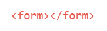

# Formulários

Formulários são o mecanismo do HTML para entrada de dados.Para fazer um formulário, usamos como raiz de todos os elementos a tag form.

Essa tag indica que estamos iniciando um formulário, recebe como principais atributos method que recebe como valor o método http que esse formulário irá executar (get, post) e action que especifica para onde enviar os dados do formulário quando um formulário é enviado.Também podemos colocar uma série de elementos HTML de entrada de dados.
Esses elementos são campos de texto, caixas de seleção, checkboxes, radio buttons, entre outros...

## Inputs

 
